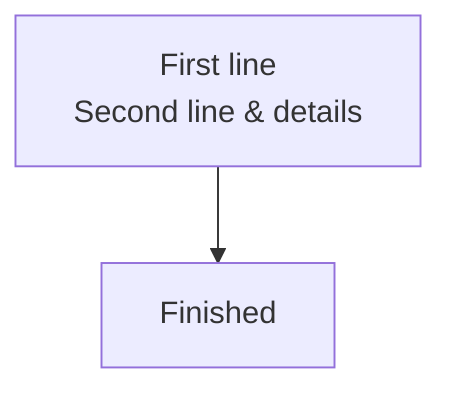
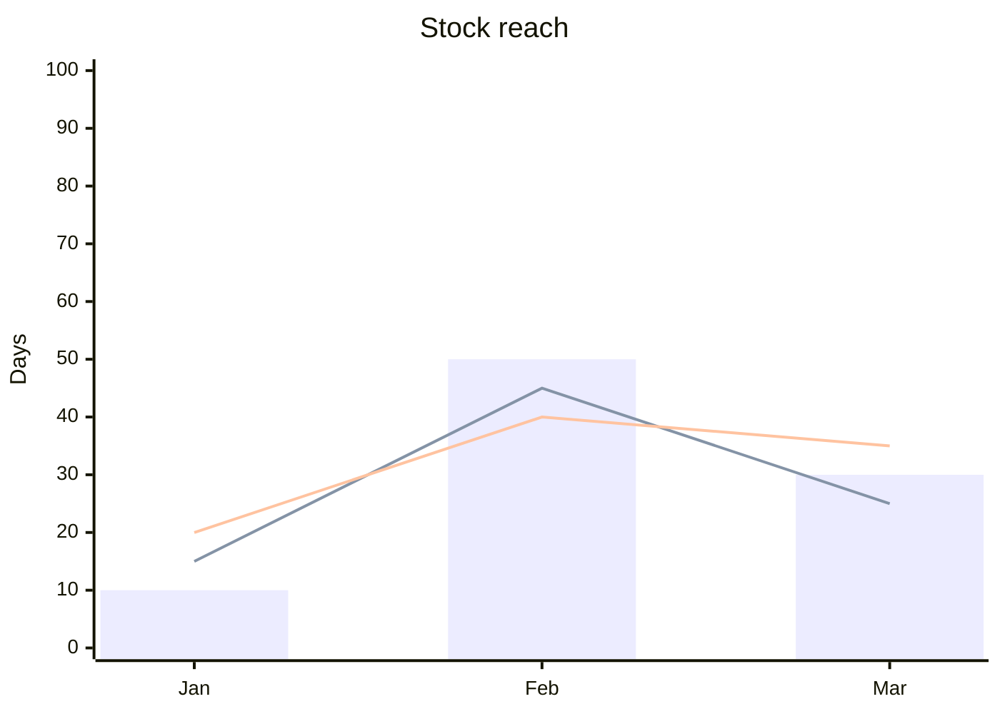
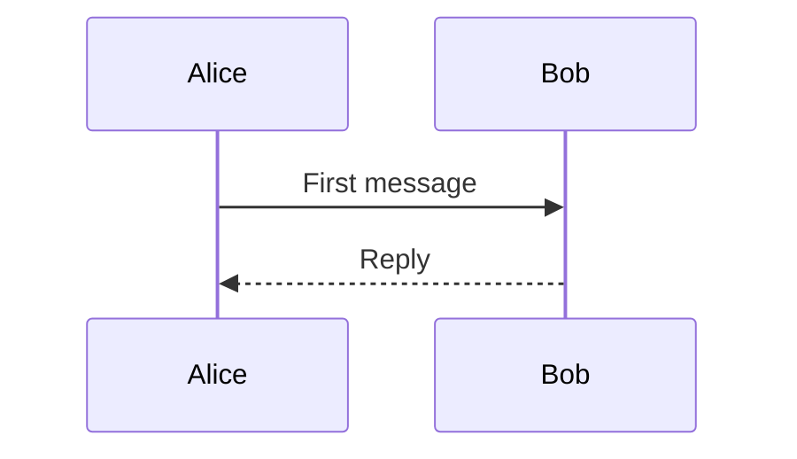
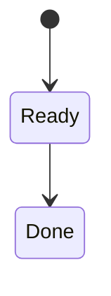

# Mermaid rendering regression

```mermaid
flowchart TD
  A["First line<br/>Second line & details"] --> B["Finished"]
```

```mermaid
xychart-beta
  title "Stock reach"
  x-axis [Jan, Feb, Mar]
  y-axis "Days" 0 --> 100
  bar "Stock & returns" [10, 50, 30]
  line [15, 45, 25]
  line "Demand forecast" [20, 40, 35]
```

```mermaid
sequenceDiagram
  Alice->>Bob: First message
  Bob-->>Alice: Reply
```

```mermaid
stateDiagram-v2
  [*] --> Ready
  Ready --> Done
```
